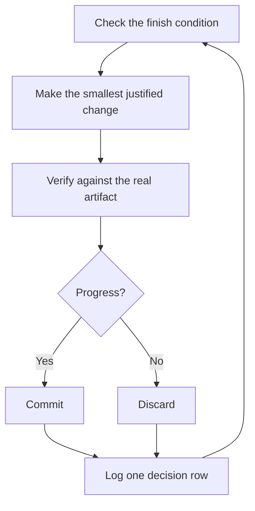

# Menjalankan tugas semalaman

Bab ini menerjemahkan halaman [Run work while you sleep](https://github.com/cursor/plugins/blob/adf3218ca2f5b9971eedc07a76bef22df7701539/pstack/docs/guide/07-overnight.md) pada panduan sumber. Inilah buah dari semua bab sebelumnya. Agent yang bisa dipercaya memverifikasi pekerjaannya sendiri adalah agent yang bisa Anda tinggalkan sendirian dengan tugas yang berat. Yang membuat hal itu aman bukan harapan, melainkan kondisi selesai (finish condition) yang bisa dicek, worktree yang terisolasi, dan log keputusan yang Anda audit pagi harinya.

## Kontrak semalaman

Penyerahan yang baik memuat tujuannya, kondisi selesai, izin, dan pintu darurat. Ia tidak perlu panjang. Contoh berikut dikutip apa adanya dari panduan sumber:

```text
/poteto-mode im going to bed. migrate every caller to the new parser in a fresh worktree off <base>.
done means zero old callers, all parser fixtures pass, old api deleted.
keep a decision log. don't ask me before committing.
/loop until done. if you're truly stuck after a few hours, stop and write up why.
```

Bedah tiap barisnya menurut panduan sumber:

- "im going to bed" adalah override sesi. Agent berhenti bertanya dan terus bekerja.
- "done means..." mengubah tujuan menjadi pemeriksaan yang bisa dijalankan tiap iterasi.
- "fresh worktree off `<base>`" menjaga run agar tidak bertabrakan dengan apa pun yang sedang Anda buka.
- "don't ask me before committing" menjawab di muka izin yang kalau tidak akan menghentikan agent.
- `/loop` adalah mekanisme bangun bawaan Cursor, bukan skill pstack. [Playbook Autonomous run](https://github.com/cursor/plugins/blob/adf3218ca2f5b9971eedc07a76bef22df7701539/pstack/skills/poteto-mode/playbooks/autonomous-run.md) memakainya untuk mengecek ulang kondisi selesai pada event atau heartbeat.
- Pintu daruratnya membiarkan agent berhenti di jalan buntu yang sesungguhnya dan menuliskan alasannya, yang lebih baik daripada delapan jam reinterpretasi tujuan yang kreatif.

Karena Anda akan meninjau pekerjaan ini setelah pergi, `/poteto-mode` merutekannya lewat [`/figure-it-out`](https://github.com/cursor/plugins/blob/adf3218ca2f5b9971eedc07a76bef22df7701539/pstack/skills/figure-it-out/SKILL.md), yang merancang fase-fase run sebelum kode apa pun dan memasang log keputusan di dalamnya.

## Apa yang dikerjakan loop sepanjang malam

Diagram berikut dikutip apa adanya dari panduan sumber:



Satu perubahan, satu pemeriksaan, satu baris log, pada tiap iterasi. Perubahan yang tidak membantu dibuang, tidak dibiarkan menumpang. Plateau berarti pivot, bukan berhenti, dan kondisi selesai tidak pernah dilonggarkan diam-diam demi menyatakan menang.

## Audit pagi

[`/show-me-your-work`](https://github.com/cursor/plugins/blob/adf3218ca2f5b9971eedc07a76bef22df7701539/pstack/skills/show-me-your-work/SKILL.md) adalah yang membuat run bisa ditinjau. Tiap baris mencatat waktu, fase, keputusan, alasan, satu pointer bukti, dan hasilnya, dalam sebuah TSV di `decisions.tsv` (atau `.audit/<task-slug>.tsv` bila beberapa run berbagi satu direktori). Berkas itu tetap lokal secara bawaan. Commit ia bila pekerjaannya cukup ambisius sehingga peninjau butuh jejaknya untuk mempercayai hasilnya.

Saat Anda kembali, minta run-nya dalam bentuk tinjauan. Prompt berikut dikutip apa adanya dari panduan sumber:

```text
/show-me-your-work catch me up on what you did last night
```

Sebelum skill itu menyerahkan ringkasannya, ia men-spawn satu peninjau pada keluarga model yang berbeda untuk membaca jejak dan transcriptnya, dan balasannya ditutup bagian Attention yang mendaftar apa yang layak Anda periksa. Baca bagian itu lebih dulu, lalu baris log yang ditunjuknya. Anda mengaudit keputusan, bukan membaca ulang seluruh malam.

## Saat malam memuat antrean, bukan satu tugas

Kontrak di atas menggerakkan satu tugas menuju satu kondisi selesai. Sebagian malam memuat lebih dari itu: antrean perubahan yang saling mandiri atau satu program utuh. Tiga playbook berikut menskalakan kepercayaan yang sama ke atas. Ketiganya sudah dibedah di bab [Playbook untuk pekerjaan panjang](24-ch-playbooks-long.md); uraian di sini mengikuti panduan sumber.

[Autopilot-full](https://github.com/cursor/plugins/blob/adf3218ca2f5b9971eedc07a76bef22df7701539/pstack/skills/poteto-mode/playbooks/autopilot-full.md) menjalankan antrean PR yang saling mandiri sampai merged. Tiap PR mendapat satu agent pemilik yang membawanya dari build sampai merge, dan tidak ada pemilik yang merge atas keputusannya sendiri. Sekawanan verifier segar memulai satu ronde di head code-ready pemilik dan lagi di tiap push berikutnya yang mengubah patch. Hanya verdict bersih pada patch yang di-merge yang mengizinkan merge:

```text
/poteto-mode full autopilot on this queue. each item is independent. i want them merged by morning.
```

[Autopilot-stack](https://github.com/cursor/plugins/blob/adf3218ca2f5b9971eedc07a76bef22df7701539/pstack/skills/poteto-mode/playbooks/autopilot-stack.md) menjalankan loop pemilik yang sama tetapi tidak mengirim apa pun. Anda terbangun dengan satu stack base branch linier yang membawa verdict verifier pada tiap tautannya, dan Andalah yang meninjau dan mendaratkannya. Pilih ini alih-alih Autopilot-full bila perubahannya saling tergandeng, atau bila Anda ingin mata Anda sendiri melihat pekerjaan sebelum ada yang merge:

```text
/poteto-mode autopilot these five changes but stack them, don't ship. i'll land the stack in the morning.
```

[Orchestrate](https://github.com/cursor/plugins/blob/adf3218ca2f5b9971eedc07a76bef22df7701539/pstack/skills/poteto-mode/playbooks/orchestrate.md) untuk program yang melampaui umur agent mana pun: berhari-hari, banyak PR bertumpuk, armada subagent di bawah satu chat koordinator yang berdiri terus. Koordinatornya menulis brief, mengumpulkan hasil subagentnya, menjaga PR belum-merged terendah tetap hijau, dan tidak pernah menulis kode sendiri. Ia mesin berat secara sengaja. Bila satu agent bisa menyelesaikan pekerjaannya dalam satu sesi, playbook itu sendiri merutekan Anda kembali ke kontrak semalaman di atas:

```text
/poteto-mode orchestrate the store migration. own it until every package is converted and merged. i'll check in twice a day.
```

**Jebakan:** durasi bukan kondisi selesai. "work on this for 4 hours" tidak memberi agent apa pun untuk dicek, dan Anda terbangun dengan empat jam gerakan alih-alih satu hasil. Beri `/loop` sebuah predikat yang bisa lulus atau gagal.

Bab berikutnya, [Resep dan jebakan](87-ch-recipes.md), mengumpulkan prompt untuk situasi yang berulang beserta daftar jebakan yang menyertainya.
